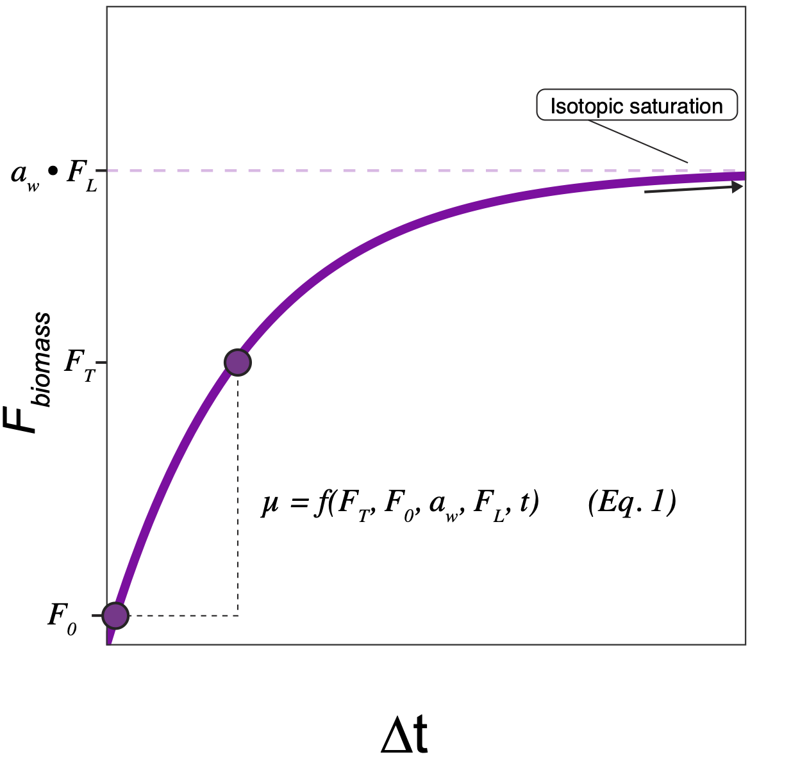

# How-To?

Designing a stable isotope probing (SIP) experiments involves three main decisions:

1.  The stable isotope of interest

2.  The duration(s) of your incubation

3.  The strength (enrichment) of your isotopic label

Question 1 is up to you and your scientific question. What are you hoping to measure? Deuterium is incorporated into a wide variety of biomolecules and is used by all forms of life. Specific $^{13}C$ carbon sources may only be utilized by certain organisms - but this can be informative to learn about carbon utilization dynamics. For this tutorial, we will focus on deuterium $^2H$.

### Microbial growth in the presence of an isotopic label

The rate at which an organism becomes enriched in $^2H$ depends on:

1.  Its growth rate $\mu$
2.  The strength of the isotopic label $F_L$
3.  Its water hydrogen assimilation efficiency constant $a_w$
4.  Its isotopic composition at the beginning of the experiment $F_0$

> Note: here and elsewhere we use the symbol $F$ to refer to the isotopic fractional abundance in atom %. $^2F$ specifically denotes the fractional abundance of deuterium. We sometimes leave out the subscript because the relationship in question is general to all stable isotopes, or for brevity.

As an organism grows, it incorporates deuterium into newly synthesized biomass according to the relationship.

$$
F_T = a_w \cdot F_L(1 - e ^{-\mu t }) + F_0 \cdot e^{-\mu t}
$$

where:

-   $F_T$ is the isotopic enrichment of biomass at time $t$ (time of sampling)

-   $a_w$ is the water hydrogen assimilation efficiency constant, which ranges from 0.0 - 1.0. This represents the fraction of an organism's biomass that is sourced from its growth water as opposed to other metabolic sources.

-   $F_L$ is the isotopic enrichment of the label solution.

-   $t$ is time

-   $\mu$ is growth rate in units of $t^-1$

> Note: Newcomers are often tripped up with the idea of a growth rate in units of inverse time. I find it useful to think of this value as *cell equivalents per unit time.* For example, a growth rate of 0.01 means that $0.01 \space d^{-1}$ cell-equivalents is produced over the course of a day.

What this looks like in graph form:

{width="500"}

Or with modeled growth rates of 0.05 and 0.13:

{width="1000"}

### Calculation of Growth Rate

To calculate growth rate, we can rearrange the prior equation to solve for µ:

$$
\mu = - \frac{1}{t} ln \left( \frac{F_T - a_w \cdot F_L}{F_0 - a_w \cdot F_L} \right) 
$$

We can also convert our growth rate to units of *generation time*:

$$
T_G = \frac{ln(2)}{\mu}
$$

The uncertainty in growth rate is given by the function:

$$
\sigma_\mu = \frac{
\sqrt{(a_w F_L - F_T)^2 \sigma^2_{F_0} +
(a_w F_L - F_0)^2 \sigma^2_{F_T} + 
a_w^2 \cdot (F_0 - F_T)^2 \sigma^2_{F_L} +
F_L^2 \cdot (F_0 - F_T)^2 \sigma^2_{a_w})
}
}
{t \cdot(a_wF_L - F_0) \cdot(a_w F_L - F_T)}
$$

Uncertainty in growth rate $\sigma_{\mu}$ depends on uncertainty in:

-   the isotopic measurement of cellular biomass, both at time of sampling $\sigma_{F_T}$ and at the beginning of the incubation $\sigma_{F_0}$

-   the uncertainty in the isotopic label strength $\sigma_{F_L}$

-   uncertainty in water hydrogen assimilation constant $a_w$

Therefore, we can calculate, across a range of microbial deuterium enrichments:

1.  Their growth rate (also - generation time)
2.  The uncertainty associated with that growth rate measurement

The uncertainty of a growth rate measurement should be compared to the growth rate measurement itself. Therefore, we use "Relative Error" in growth rate as our metric of reliability:

$$
Relative \space Error = \frac{\sigma_{\mu}}{\mu} \times 100 \%
$$

### Interpreting the Uncertainty Plots

Examining the uncertainty plots, take note of the following:

1.  Asymptotic rise in relative error at longer generation times corresponds to difficulty distinguishing the organism's isotopic enrichment from noise.

2.  Asymptotic rise in relative error at shorter generation times corresponds to an organism becoming *so* enriched that it approaches isotopic equilibrium with the label solution ($a \cdot F_L$).

3.  The error optimum represents the generation time/growth rate at which relative error is minimized. Consider this your optimum measurement precision.

{width="800"}
